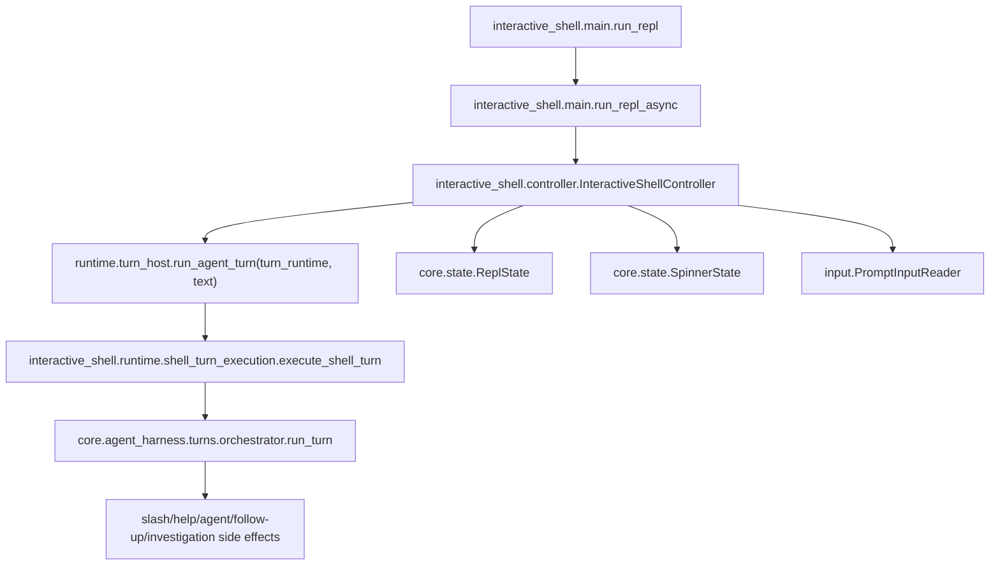

# Runtime package rules

These instructions apply to `interactive_shell/runtime/` and all
subdirectories. Parent `AGENTS.md` files still apply.

The `runtime` package holds the focused support modules for the interactive
shell runtime; the top-level bootstrap and controller live one level up in
`interactive_shell/`.

## Ownership map (locked)

Keep these boundaries strict. If a change crosses concerns, move code to the
owner module instead of broadening module responsibilities.

- `../main.py` — process/bootstrap boundary only: startup sweep, TTY/non-TTY
  gate, banner display, the async boundary (`asyncio.run`). Do not move
  per-turn dispatch/runtime logic back into startup bootstrap.
- `startup/first_launch_github.py` — first-launch GitHub sign-in gate only.
- `startup/initial_input.py` — scripted non-interactive initial-input replay
  only.
- `../controller.py` — `InteractiveShellController`: prompt lifecycle,
  submitted-input handling, queued-turn consumption, per-turn task scheduling,
  alert listener setup/teardown (the inbox is part of the running shell
  lifecycle), `AgentTurnRuntime` construction and shutdown, prompt-mediated
  confirmation waiting, turn telemetry, coordination between prompt/background/
  shutdown helpers. Nothing else should own shell lifecycle orchestration.
- `core/prompt_manager.py` — prompt-toolkit setup, prompt rendering callbacks,
  pending prompt defaults, autosubmit handling only.
- `input/` — prompt input event conversion only: EOF, Ctrl-C, CPR cleanup,
  session resume hints.
- `utils/input_policy.py` — prompt stdin/spinner gating decisions for turns
  only.
- `background/workers.py` — alert watcher lifecycle, spinner ticker lifecycle,
  sampler startup, turn-start background-output drains only.
- `background/runner.py`, `background/notifications.py` — session-local
  background investigation launchers and RCA completion notification delivery
  only (record/preferences ownership itself lives in
  `core.agent_harness.session.background`).
- `core/state.py` — `ReplState`, `SpinnerState`: runtime state and transition
  helpers only (see State ownership rules below).
- `core/turn_detection.py` — pure text classifiers for cancel/confirm/
  correction detection only.
- `core/confirmation.py` — prompt-mediated confirmation waiting only.
- `turn_host.py` — `run_input_loop` (read/handle input until exit),
  `run_agent_turn_queue` (consume queued prompts via an injected `run_turn`),
  and `run_agent_turn(runtime, text)` (presentation, dispatch state,
  prompt-mediated confirmation, turn-entry invocation) over an
  `AgentTurnRuntime` — the immutable dependency bundle (`session`, `state`,
  `spinner`, `invalidate_prompt`, `request_exit`) the controller constructs.
- `agent_presentation.py` — `ConsoleAgentEventSink`: terminal presentation for
  agent lifecycle events (spinner, prompt suppression, `console.print`, CPR
  drain) only — not in the turn-entry adapter or the core harness.
- `shell_turn_execution.py` — `execute_shell_turn`: binds shell adapters
  (`action_turn.py`, `integration_tool_gathering.py`, `answer_turn.py`) plus
  accounting around `core.agent_harness.turns.orchestrator.run_turn`. Each
  adapter owns its own binding; tests import them from their owning module,
  not `shell_turn_execution`.
- `core.agent_harness.session.tasks` — cross-session task registry surfaced via
  `/tasks` and `/cancel` only.
- `core.agent_harness.accounting.token_accounting` — session-scoped LLM token
  accounting and run metadata only.
- Reusable per-agent session state (`Session`) lives in
  `core.agent_harness.session`. Terminal runtime context assembly
  (`ReplRuntimeContext`, `create_repl_runtime_context`) lives in
  `interactive_shell.runtime.context`.

## Data flow contract (locked)

The interactive runtime must keep this shape — do not invert this dependency
direction:

1. `interactive_shell.main.run_repl` (sync entrypoint) sets up process-level
   concerns and calls `run_repl_async`.
2. `interactive_shell.main.run_repl_async` (async body) creates
   `InteractiveShellController`.
3. `InteractiveShellController.start_interactive_shell` owns prompt lifecycle,
   submitted input handling, queued-turn consumption, and per-turn task
   scheduling.
4. `runtime.turn_host.run_agent_turn_queue` consumes queued prompts through an
   injected `run_turn` callable, which in production is
   `lambda text: run_agent_turn(self.turn_runtime, text)`.
5. `runtime.turn_host.run_agent_turn(runtime, text)` drives one submitted turn:
   presentation setup, prompt-mediated confirmation, dispatch state, per-turn
   execution.
6. `interactive_shell.runtime.shell_turn_execution.execute_shell_turn` binds
   shell adapters around `core.agent_harness.turns.orchestrator.run_turn`.
7. `core.agent_harness` owns one prompt's action/answer mechanics and
   accounting finalization. Terminal presentation for `AgentEvent` emissions
   lives in `runtime/agent_presentation.py`.

## State ownership rules

- `ReplState` is the single source of truth for: active dispatch task,
  cancellation event, confirmation event/response lifecycle, exit requests,
  and the explicit turn `phase` (`TurnPhase`: `IDLE`, `DISPATCHING`,
  `AWAITING_CONFIRMATION`, `CANCELLING`).
- Mutate turn state through the `ReplState` transition methods, never by
  poking raw fields from other modules:
  - `start_dispatch` / `attach_turn_task` / `attach_cancel_event` -> `DISPATCHING`
  - `begin_confirmation` -> `AWAITING_CONFIRMATION`; `clear_confirmation` returns
    to `DISPATCHING`/`IDLE` (and never clobbers an in-progress `CANCELLING`)
  - `cancel_current_dispatch` -> `CANCELLING` (only when there is something to
    cancel) then signals the cancel/confirm events and `task.cancel`
  - `finish_dispatch` / `clear_current_task` -> `IDLE`
- `phase` is authoritative for confirmation and cancelling. `is_dispatch_running()`
  stays derived from the asyncio task (the runtime truth of the in-flight turn);
  `is_awaiting_confirmation()` and `is_cancelling()` are derived from `phase`.
- Do not reorder the signaling inside `cancel_current_dispatch` or move the
  `confirm_response` reset after the `confirm_event` publish in
  `begin_confirmation`; both orderings are load-bearing for cancellation and
  confirmation race-safety. Concretely: Esc or a bare cancel command must move
  the turn to `CANCELLING` and signal both the cancel event and any pending
  confirmation event before `task.cancel`; confirmation prompts are cancel-safe
  and must never silently auto-confirm; a cancel during confirmation must not
  be downgraded back to `DISPATCHING`.
- `SpinnerState` owns spinner rendering state only; it must not depend on
  runtime task management.

## Turn execution rules

- Do not reintroduce `dispatch.py`, an `AgentTurnRunner`-style wrapper class, or
  any compatibility-only forwarding module.
- Turn accounting is consolidated behind `ShellTurnAccounting` in
  `interactive_shell/runtime/core/turn_accounting.py`, invoked from
  `execute_shell_turn`. It owns action-agent analytics, terminal-turn aggregate
  telemetry, prompt-recorder flush, conversational-turn persistence, and the
  final assistant-intent stamp. `runtime.action_turn.run_action_tool_turn`
  returns facts only (`ToolCallingTurnResult` with `accounting_status` of
  `completed` / `not_run`) and emits no analytics itself. Do not re-scatter
  accounting back into `run_action_tool_turn` or standalone `_record_*` helpers.

## Compatibility surface policy

- `runtime/__init__.py` should be a thin export layer; do not duplicate
  business logic in it.
- `runtime/__init__.py` exports `Session` from `core.agent_harness.session` and
  runtime-context helpers from `interactive_shell.runtime.context`. New shared
  runtime code should import session names directly from
  `core.agent_harness.session`.
- Do not re-add `_xxx` underscore aliases or wrapper functions for
  compatibility. Tests and callers should import canonical names from their
  owning submodule.

## Test seam policy

- Prefer patching canonical module seams: `interactive_shell.controller.*` for
  prompt-loop, queued-turn, and confirmation behavior; `interactive_shell.main.*`
  for process/bootstrap behavior; `runtime.core.state.*` for state-specific
  behavior.
- Avoid adding new tests that monkeypatch package-root internals in
  `runtime.__init__` unless there is no stable canonical seam.
